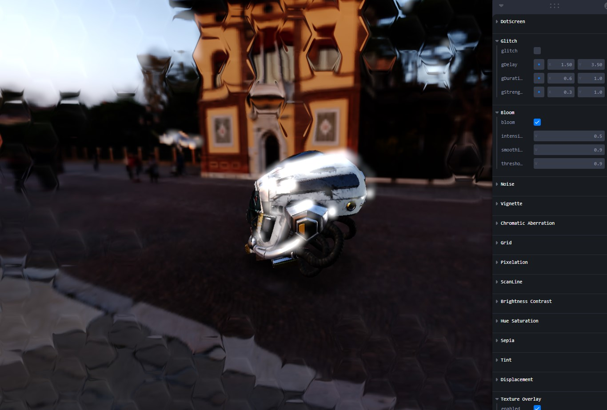

# Post Processing



## Preview Link:

https://post-processing-nu.vercel.app/

## Setup
Download [Node.js](https://nodejs.org/en/download/).
Run this followed commands:

``` bash
# Install dependencies (only the first time)
yarn

# Run the local server at localhost:8080
yarn dev

# Build for production in the dist/ directory
yarn build
```
