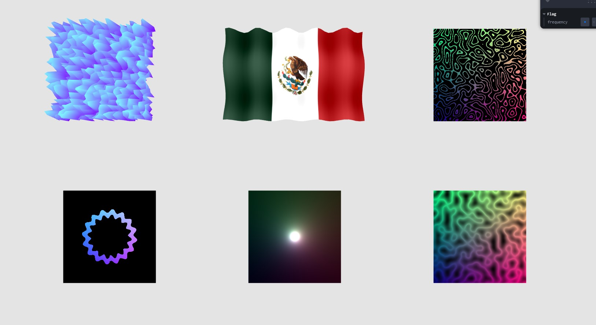

# Shader Basics



## Preview Link:

https://maumruiz-scroll.netlify.app

## Setup
Download [Node.js](https://shader-basics.vercel.app/).
Run this followed commands:

``` bash
# Install dependencies (only the first time)
yarn

# Run the local server at localhost:8080
yarn dev

# Build for production in the dist/ directory
yarn build
```
